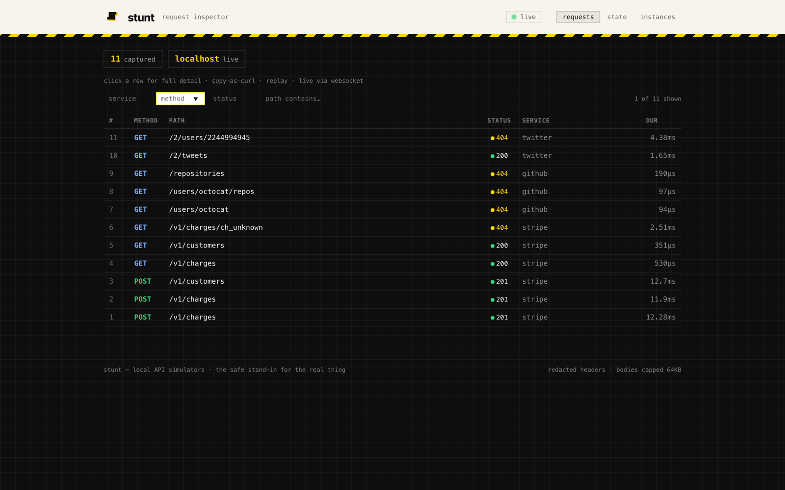

# stunt

### A stunt double for your APIs — test against real services, **locally**, without remote accounts.

`stunt` spins up **stateful, realistic** local stand-ins for the APIs you integrate
(Stripe, Drive, Dropbox, gRPC services, GraphQL APIs, …) so you can develop and test
without creating accounts, handling live credentials, burning money, hitting rate limits,
or depending on the network. One static Go binary. Everything deterministic.

> See the **magic in 30 seconds**:


```bash
stunt demo        # boots a stateful Stripe-style sim; prints copy-paste curl that creates a charge,
                  # lists it back (stateful!), captures it, and fires a webhook — all locally
```

---

## Why

Integrating remote APIs is painful for testing: you create accounts, juggle credentials,
pay for usage, hit rate limits, depend on the network, and get **non-deterministic**
results. Existing mock tools (WireMock, Prism, MSW, Microcks) are great at *static* and
*schema* mocking, but they don't give you a **stateful, runnable stand-in** for an
arbitrary service without hand-authoring everything.

`stunt` does. A Stripe-style adapter actually stores the charge you create — create it,
list it, capture it, get the webhook — and it all resets on `stunt clean`.

### How it's different

| | **stunt** | WireMock | Prism | MSW | Mockoon |
|---|---|---|---|---|---|
| **Stateful** (create → list → mutate persists) | ✅ | partial | ❌ | ❌ | ❌ |
| **Sandboxed adapter logic** (safe to install strangers' mocks) | ✅ Starlark | ❌ | ❌ | ❌ JS | ❌ JS |
| **Protocols** | REST, gRPC (+streaming), WebSocket, GraphQL | REST (+ limited) | REST, OpenAPI | REST, GraphQL | REST |
| **Single static binary, no runtime deps** | ✅ Go | JVM | node | node | electron |
| **Generate from real API descriptions** | OpenAPI, HAR, proto | OpenAPI | OpenAPI | — | OpenAPI |
| **Adapter ecosystem / catalog** | ✅ (git-distributed) | stubs | — | — | templates |

*(Each of those tools is excellent at what it does; this is a feature matrix, not a
verdict. Corrections welcome.)*

---

## Install

**Go (any OS — Linux, macOS, Windows):**

```bash
go install stuntapi.com/stunt/cmd/stunt@latest
```

**macOS (Homebrew):**

```bash
brew install --cask stuntapi/tap/stunt
```

**Windows (winget):**

```powershell
irm https://raw.githubusercontent.com/stuntapi/winget/main/install.ps1 | iex
```

Pre-built binaries for every platform are also on the
[Releases page](https://github.com/stuntapi/stunt/releases).

## Quickstart

```bash
stunt init     # writes a sample stunt.yaml
stunt plan     # validate + show what will run (warns on unloadable adapters)
stunt up       # serve all services (Ctrl-C to stop)  — logs every request
stunt stop     # stop a server by PID or this manifest's — graceful, works on any OS
stunt down     # stop a backgrounded `stunt up`
stunt clean    # reset all adapter state to seed fixtures
```

Inline, declarative service (no adapter needed) — probabilistic faults, templates, conditions:

```yaml
version: 1
rng_seed: 42
network: { mode: port, base_port: 8000 }
services:
  example:
    rules:
      - match: { method: GET, path: /hello }
        when: { chance: 20 }                       # 20% of replies error
        respond: { status: 503, body: { inline: { error: boom } } }
      - match: { method: GET, path: /hello }
        respond: { status: 200, body: { template: '{"message":"hi","id":"{{ faker.ID "k" }}"}' } }
```

Stateful adapter service (the bundled Stripe-style sim):

```yaml
version: 1
network: { mode: port, base_port: 8000 }
services:
  stripe:
    adapter: ./adapters/stripe-style
    config:
      webhook_url: http://localhost:9090/webhook   # events_emit() delivers here
```

Then `curl http://127.0.0.1:8000/v1/charges -H "Authorization: Bearer sk_test_demo" -d '{"amount":1000,"currency":"usd"}'`,
list it back, capture it — state persists across requests and restarts.

## Adapters

An adapter is a directory describing how to simulate one API: `adapter.yaml` + Starlark
handlers + fixtures/schemas. Logic runs in a **sandboxed Starlark VM** (no host I/O —
that's why strangers' adapters are safe to install) backed by stateful primitives
(Collection / KV / Blob / Identity / Events). Build your own:

```bash
stunt adapter new myapi-style                 # scaffold (synthetic data)
stunt adapter import openapi spec.yaml        # generate from an OpenAPI doc
stunt adapter import har session.har          # infer endpoints + synthetic fixtures
stunt adapter import proto api.proto          # scaffold a gRPC adapter (descriptor + handlers)
stunt adapter lint ./myapi-style              # enforce SYNTHETIC data only (the safety guard)
stunt adapter test ./myapi-style              # conformance vs your local real traces
stunt catalog search stripe                   # browse the adapter registry
```

**Reference adapters in this repo** — 95 of them (Stripe, Salesforce, Discord, Twilio,
Square, Adyen, AWS S3, Google/Microsoft/Apple families, blockchain RPCs, …; all unofficial,
synthetic-data-only, with a DISCLAIMER). Browse them with `stunt catalog search`. Every one
passes an adversarial input-safety sweep (garbage params, null/malformed bodies, ~30 tampered
cursor/limit param names — never a 5xx), coverage-guided fuzzing of the engine's parsers and
dispatch (`just fuzz`), and conformance suites that drive **real provider SDKs** — stripe-go,
aws-sdk-go-v2, go-github, twilio-go, go-shopify, google-api-go-client — end-to-end against
the adapters (`just conformance`), plus Node suites driving **stripe-node, octokit, and
twilio-node** through the real `stunt` binary (`just conformance-node`). Highlights:

| Adapter | Simulates | Backing |
|---|---|---|
| `stripe-style` | payments — full API surface (158 endpoints): **PaymentIntents, disputes, refunds, the Billing suite (subscriptions/invoices/credit notes), Checkout Sessions, SetupIntents, balance transactions**, Connect (persons/capabilities/application fees), **Test Clocks** (deterministic billing), **Idempotency-Key**, cursor-paginated lists, **signed webhooks + registration-gated delivery** | Collection + Starlark |
| `salesforce-style` | CRM — sObjects CRUD, **general SOQL** (WHERE/IN/LIKE/AND/OR, ORDER BY, LIMIT/OFFSET), OAuth (password/auth-code/refresh/**JWT bearer**) | Collection + Starlark |
| `discord-style` | bot API — REST + **WebSocket Gateway (HELLO→IDENTIFY→READY→dispatch)** + **Ed25519-signed interactions** | Collection + Starlark |
| `emailoctopus-style` | email — **lists + contact lifecycle (double/single opt-in, unsubscribe/resubscribe)**, fields/tags CRUD, campaigns reports, **RFC 7807 errors** + cursor paging | Collection + Starlark |
| `drive-style` | files API — upload/get/download/list/patch/delete, folders, about/quota, resumable uploads | Blob + Collection |
| `dropbox-style` | files API (RPC-style) — upload/download/list_folder/get_metadata | Blob + Collection |
| `twitter-style` | mock OAuth, tweets (CRUD), users, timeline | Collection (pure-mock) |
| `echo-style` | gRPC service (unary + streaming) + WebSocket — multi-transport reference | Collection + KV |
| `blog-style` | GraphQL blog API — users/posts/comments, nested relations, mutations | Collection + Starlark |

Full adapter authoring reference (the `adapter.yaml` schema, **Starlark builtins reference** with
exact signatures, gRPC/WebSocket/GraphQL sections): **[`adapters/README.md`](adapters/README.md)**.

**Fidelity platform** (cross-cutting, in every adapter): real list-filter/query params
(`query_select`), cursor pagination, validated tokens with expiry (401 paths), per-provider
signed webhook delivery (HMAC/ECDSA/Ed25519 schemes), derive-on-read async state machines
(RUNNING/FAILED + failure injection), multipart uploads, byte-exact binary round-trips.

## Transports & primitives

- **Transports**: REST, gRPC (unary **and streaming**), WebSocket, GraphQL (full introspection + DoS limits).
- **Rules engine**: first-match-wins; `match` (method/path globs/headers), `when.chance` (probabilistic),
  `when.expr` (boolean over `request.*`), `respond` (status/headers/latency/timeout + `body.inline|file|template`).
- **Primitives**: Collection (SQLite), KV, Blob (FS), Identity (HMAC tokens), Events (webhooks w/ retry),
  Clock+scheduler (deterministic), Generator, Validator (JSON-Schema). State persists in `.stunt/state/`.
- **Networking**: optional portless.dev-style TLS proxy on `*.localhost` (HTTP/2, local CA). The privileged
  listener forwards to an **unprivileged** engine, so adapter code never runs as root. WSS passthrough verified.

## Observability dashboard

Every running server serves its **own localhost dashboard** — a live request inspector (HTTP/gRPC/WebSocket, bodies, copy-as-curl, replay), a **state browser** (the collections/kv/blobs your tests created), **snapshot/restore** for deterministic runs, and an **instance manager**. A matching CLI (`--json`) backs every feature.

```
$ stunt up
  dashboard:  http://127.0.0.1:54321   (token: 9f3c…)
$ stunt ui          # open it
$ stunt requests --follow    # live feed in the terminal
$ stunt ps          # list running servers across all manifests
```

Loopback-only, token-authed, DNS-rebinding-guarded; sensitive headers redacted; logging is async (never backpressures requests). Full guide with screenshots: **[`docs/dashboard.md`](docs/dashboard.md)**.



## Safety & trust

The defining property: **a community adapter is safe to install** — adapter logic is sandboxed
Starlark with no host I/O, bounded by execution-step limits; all file reads an adapter can trigger
are path-containment-guarded; `stunt adapter lint` enforces synthetic-data-only. See
**[SECURITY.md](SECURITY.md)** for the full threat model.

## Contributing

Contributions are welcome — especially **adapters**. See **[CONTRIBUTING.md](CONTRIBUTING.md)**
for the workflow and quality gates (`just ci` = build + `test -race` + vet + gofmt + mod-tidy +
lint-adapters). Quick path: `stunt adapter new myapi-style` → edit → `stunt adapter lint` → PR.

## Status & roadmap

**v0.3.0 — cross-platform lifecycle + Starlark ergonomics.** `stunt stop`/`down`
now work on **Windows** (previously they errored and left the server holding its
port) and shut servers down **gracefully** on every platform via a dashboard
`POST /api/shutdown` endpoint (draining in-flight requests instead of hard-killing).
In Starlark handlers, `req` supports attribute access (`req.method`, `req.headers`)
alongside dict access, and header lookups are now case-insensitive.

**v0.2.2 — observability dashboard.** Core plus a full per-server dashboard (live
request inspector, state browser, snapshot/restore, instance manager) are built,
self-tested (`just ci` green), and dogfooded. On the roadmap: a **public catalog**
(today's `stunt catalog` is offline/bundled + git refs), `stunt setup` privileged-path
hardening, and broader adapter coverage.
**Not planned for v1**: GraphQL subscriptions, npm adapter distribution.

Found a security issue? See **[SECURITY.md](SECURITY.md)** — do not open a public issue.

## Project layout

`cmd/stunt` (CLI) · `internal/{rules,manifest,engine,adapter(+runtime),starlark,grpcsim,graphqlsim}`
· `internal/primitives{,/blob,/clock,/events,/gen,/identity,/kv,/validator}` ·
`internal/netutil{,/proxy}` · `internal/contrib{,/openapi,/har,/lint,/conform,/proto,/scaffold}`
· `internal/catalog` · `internal/cli` · `internal/adapterdist` · `adapters/`.

## Reference & contributing

- **Operating guide:** `AGENTS.md` (or run `stunt llm` for the in-binary reference) — the full
  manifest schema, CLI reference, and the complete Starlark handler API.
- **Contributing:** see `CONTRIBUTING.md`.
