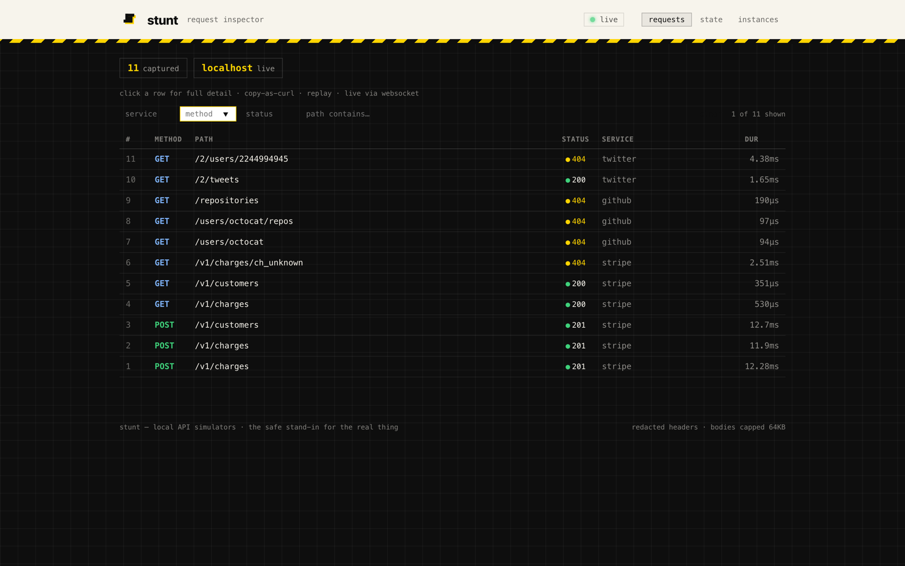

# stunt

### A stunt double for your APIs — test against real services, **locally**, without remote accounts.

`stunt` spins up **stateful, realistic** local stand-ins for the APIs you integrate
(Stripe, Drive, Dropbox, gRPC services, GraphQL APIs, …) so you can develop and test
without creating accounts, handling live credentials, burning money, hitting rate limits,
or depending on the network. One static Go binary. Everything deterministic.

> See the **magic in 30 seconds**:


```bash
stunt demo        # boots a stateful Stripe-style sim; prints copy-paste curl that creates a charge,
                  # lists it back (stateful!), captures it, and fires a webhook — all locally
```

**Contents:** [Why](#why) · [Install](#install) · [Quickstart](#quickstart) ·
[Manifest](#the-manifest-stuntyaml) · [Rules](#rules--declarative-behavior) ·
[Profiles](#profiles--runtime-activatable-behavior) · [Adapters](#adapters) ·
[Transports](#transports) · [State & primitives](#state--primitives) ·
[Webhooks](#webhooks--events) · [Networking & TLS](#networking--tls) ·
[Observability & lifecycle](#observability--lifecycle) · [Determinism](#determinism) ·
[Safety](#safety--trust) · [Status](#status--roadmap) · [Reference](#reference--contributing)

---

## Why

Integrating remote APIs is painful for testing: you create accounts, juggle credentials,
pay for usage, hit rate limits, depend on the network, and get **non-deterministic**
results. Existing mock tools (WireMock, Prism, MSW, Microcks) are great at *static* and
*schema* mocking, but they don't give you a **stateful, runnable stand-in** for an
arbitrary service without hand-authoring everything.

`stunt` does. A Stripe-style adapter actually stores the charge you create — create it,
list it, capture it, get the webhook — and it all resets on `stunt clean`.

### How it's different

| | **stunt** | WireMock | Prism | MSW | Mockoon |
|---|---|---|---|---|---|
| **Stateful** (create → list → mutate persists) | ✅ | partial | ❌ | ❌ | ❌ |
| **Sandboxed adapter logic** (safe to install strangers' mocks) | ✅ Starlark | ❌ | ❌ | ❌ JS | ❌ JS |
| **Protocols** | REST, gRPC (+streaming), WebSocket, GraphQL | REST (+ limited) | REST, OpenAPI | REST, GraphQL | REST |
| **Single static binary, no runtime deps** | ✅ Go | JVM | node | node | electron |
| **Generate from real API descriptions** | OpenAPI, HAR, proto | OpenAPI | OpenAPI | — | OpenAPI |
| **Adapter ecosystem / catalog** | ✅ (git-distributed) | stubs | — | — | templates |

*(Each of those tools is excellent at what it does; this is a feature matrix, not a
verdict. Corrections welcome.)*

---

## Install

**Go (any OS — Linux, macOS, Windows):**

```bash
go install stuntapi.com/stunt/cmd/stunt@latest
```

**macOS (Homebrew):**

```bash
brew install --cask stuntapi/tap/stunt
```

**Windows (winget):**

```powershell
irm https://raw.githubusercontent.com/stuntapi/winget/main/install.ps1 | iex
```

Pre-built binaries for every platform are also on the
[Releases page](https://github.com/stuntapi/stunt/releases).

## Quickstart

```bash
stunt init     # writes a sample stunt.yaml
stunt plan     # validate + show what will run (warns on unloadable adapters)
stunt up       # serve all services (Ctrl-C to stop)  — logs every request
stunt stop     # stop a server by PID or this manifest's — graceful, works on any OS
stunt down     # stop a backgrounded `stunt up`
stunt clean    # reset all adapter state to seed fixtures
```

Point your client at the served address (`YOURAPI_BASE_URL=http://127.0.0.1:8000`) and
run your tests. Every request is logged, state persists across requests and restarts,
and `stunt clean` gives you a fresh world.

---

## The manifest (`stunt.yaml`)

One file declares everything stunt serves. A service is either **rules-only**
(declarative responses, no code) or **adapter-backed** (a directory of Starlark handlers
+ state — see [Adapters](#adapters)):

```yaml
version: 1
rng_seed: 42                          # fixed seed → identical synthetic data + fault rolls every run
network:
  mode: port                          # one port per service: base_port, +1 each, alphabetical
  base_port: 8000

services:
  stripe:
    adapter: embedded:stripe-style    # bundled IN the binary — nothing to clone, no network
    config:
      webhook_url: http://127.0.0.1:9999/hooks   # where events_emit() delivers webhooks
  myapi:
    adapter: ./adapters/myapi-style   # local dir, or git:github.com/org/repo@ref
    max_body_bytes: 8388608           # per-request body cap (default 1 MiB; oversize → 413)
  example:                            # rules-only service — inline declarative behavior
    rules:
      - match: { method: GET, path: /hello }
        when: { chance: 20 }                       # 20% of replies error
        respond: { status: 503, body: { inline: { error: boom } } }
      - match: { method: GET, path: /hello }
        respond: { status: 200, body: { template: '{"message":"hi","id":"{{ faker.ID "k" }}"}' } }
```

**Networking modes:** `port` (each service on `127.0.0.1:<port>`; `network.mode` is
required — pick one explicitly) or `subdomain`
(real TLS via a locally-generated CA, SNI-routed `https://stripe.localhost`-style hosts;
see [Networking & TLS](#networking--tls)).

**Adapter sources:** `embedded:<name>` (ships in the binary) · a local path ·
`git:github.com/org/repo@ref`. `stunt adapter add <src>` wires a source into the
manifest for you.

---

## Rules — declarative behavior

Rules answer requests without any code. Within a service they evaluate **in declaration
order, first match wins** — a catch-all `match: { path: "/**" }` is the usual 404
backstop:

```yaml
rules:
  - name: flaky-when-debugging
    match:
      method: GET
      path: /flaky/**                 # glob over the path
      headers: { X-Debug: "1" }       # header conditions
    when:
      chance: 20                      # percent probability, 0..100 (rng_seed-driven)
      # expr: "request.body.amount > 1000"   # OR a boolean expression over request.*
    respond:
      status: 503
      headers: { Content-Type: application/json, Retry-After: "1" }
      body: { inline: { error: simulated } }  # OR { file: body.json }
                                              # OR { template: tmpl.json }
      latency_ms: 100                 # simulated latency
      # behavior: timeout             # force a hang; drops the connection after
                                      # latency_ms (default 30s)
```

**Templates** are Go `text/template` with fake-data helpers — `{{ faker.Email }}`,
`{{ faker.ID "k" }}`, `{{ uuid }}`, `{{ now.Format "2006-01-02T15:04:05Z07:00" }}` — so
even rules-only services return varied, realistic, deterministic payloads.

Rules-only services cover static and probabilistic mocking; when you need **state**
(create → list → mutate), **auth flows**, or **webhooks**, use an adapter.

---

## Profiles — runtime-activatable behavior

A **profile** is a named behavior mode you can switch on and off at runtime — the
on-demand version of "what does my client do when the dependency misbehaves?".
Retry/backoff paths, circuit breakers, degraded UX: activate the profile, run the test,
deactivate. No YAML edits, no restart.

```bash
$ stunt profile activate launch-day
activated preset "launch-day"
(runtime-only — resets on restart; `stunt up --profile` boots with one)

$ curl -s http://127.0.0.1:8000/v1/charges | head -c 60
{"error":"rate_limit_error"}                 # the world changed — same YAML, no restart

$ stunt profile deactivate
deactivated all profiles
```

### The three ways a profile comes to exist

**1. Rule bundles per service** — declared right in `stunt.yaml`. While active, the
rules run as a **pre-dispatch override layer**: they intercept requests *before*
handlers and base rules, so they reach handler-backed routes that base rules cannot
(matching your real fault-injection needs — chaos that can't touch `/v1/charges` would
be useless).

```yaml
services:
  stripe:
    adapter: embedded:stripe-style
    profiles:                         # rule bundles for THIS service
      degraded:
        description: occasional 429s + slow responses
        rules:
          - match: { path: /v1/** }
            when: { chance: 30 }
            respond: { status: 429, body: { inline: { error: rate_limited } } }
```

**2. Adapter-authored modes** — an adapter ships behavior modes its handlers implement,
so the *provider's own* degraded semantics come pre-modeled. The sqs-style adapter
declares `throttled` in its `adapter.yaml`; its handlers read the `profile_active()`
builtin:

```yaml
# adapters/sqs-style/adapter.yaml
profiles:
  throttled: "alternate ReceiveMessage calls return empty — exercise consumer retry/backoff paths"
```

```python
# inside a handler:
if profile_active() == "throttled":
    return respond(200, {"Messages": []})   # this receive yields nothing; client retries
```

**3. Global presets** — one activation assigns profiles across services, so a whole
scenario flips at once:

```yaml
profiles:                             # top level of stunt.yaml
  launch-day:                         # `stunt profile activate launch-day`
    description: both dependencies degraded
    set:
      stripe: degraded                # the manifest bundle from (1)
      sqs: throttled                  # authored by the sqs-style adapter in (2)
```

Nothing predefined ships — presets like `launch-day` are yours to declare. A name
declared in *both* the manifest and an adapter activates both layers together (manifest
rules + the handler behavior), which is the point: one name, one world.

### Driving profiles

```bash
stunt profile list                    # every activatable profile, active ones marked
stunt profile show launch-day         # what it sets, where it's active
stunt profile activate launch-day     # preset
stunt profile activate throttled      # unique name → auto-targeted to its service
stunt profile activate degraded --service stripe   # disambiguate a shared name
stunt profile deactivate              # all services
stunt profile deactivate --service sqs
stunt up --profile launch-day         # boot default (unknown names fail before serving)
```

The dashboard's **profiles** panel does the same with one click, and the read commands
(`stunt profile list`, `stunt requests`, `stunt ps`, …) print `--json` for scripts.

**Semantics worth knowing:**

- **Runtime-only by design** — activation is server state, not config; a restart resets
  the world (`stunt up --profile` restores a default if you want one).
- **Precedence** — active profile rules run before handler/base-rule dispatch (see (1)).
  WebSocket upgrades and GraphQL dispatch earlier still, so profiles don't intercept
  those two transports.
- **Determinism** — chance rules inside a profile draw the same per-service stream as
  base rules (fixed `rng_seed` → reproducible fault rolls). Adapter modes that keep
  counters across calls (like sqs-style's alternating throttling) persist the counter
  in service state: restart resets the *activation*, not the counter — pair those with
  `stunt reset <service>` for a fully fresh sequence. Details in the
  [determinism contract](#determinism).

Use-case guide — chaos testing, revoked credentials on demand, the one broken
customer, hanging dependencies, flipping worlds between test cases:
**[`docs/profiles.md`](docs/profiles.md)**.

---

## Adapters

An adapter is a directory describing how to simulate one API: `adapter.yaml` + Starlark
handlers + fixtures/schemas. Logic runs in a **sandboxed Starlark VM** (no host I/O —
that's why strangers' adapters are safe to install) backed by stateful primitives
(Collection / KV / Blob / Identity / Events). Build your own:

```bash
stunt adapter new myapi-style                 # scaffold (synthetic data)
stunt adapter import openapi spec.yaml        # generate from an OpenAPI doc
stunt adapter import har session.har          # infer endpoints + synthetic fixtures
stunt adapter import proto api.proto          # scaffold a gRPC adapter (descriptor + handlers)
stunt adapter lint ./myapi-style              # enforce SYNTHETIC data only (the safety guard)
stunt adapter test ./myapi-style              # conformance vs your local real traces
stunt catalog search stripe                   # browse the adapter registry
```

**Reference adapters in this repo** — 98 of them (Stripe, Salesforce, Discord, Twilio,
Square, Adyen, AWS S3, Google/Microsoft/Apple families, blockchain RPCs, …; all unofficial,
synthetic-data-only, with a DISCLAIMER). Browse them with `stunt catalog search`. Every one
passes an adversarial input-safety sweep (garbage params, null/malformed bodies, ~30 tampered
cursor/limit param names — never a 5xx), coverage-guided fuzzing of the engine's parsers and
dispatch (`just fuzz`), and conformance suites that drive **real provider SDKs** — stripe-go,
aws-sdk-go-v2, go-github, go-ethereum, twilio-go, go-shopify, google-api-go-client —
end-to-end against the adapters (`just conformance`), plus Node suites driving
**stripe-node, octokit, twilio-node, @slack/web-api, plaid, @hubspot/api-client,
square, openai, resend, @discordjs/rest, jsforce, node-zendesk, and jira.js**
through the real `stunt` binary (`just conformance-node`). The full
per-adapter scorecard — which SDK at which version, covered behaviors, the exact
route surface covered, what's missing from the real API, documented deviations,
verification tier — is generated into
**[`CONFORMANCE.md`](CONFORMANCE.md)** (`just conformance-matrix`; CI fails on drift).
Highlights:

| Adapter | Simulates | Backing |
|---|---|---|
| `stripe-style` | payments — full API surface (158 endpoints): **PaymentIntents, disputes, refunds, the Billing suite (subscriptions/invoices/credit notes), Checkout Sessions, SetupIntents, balance transactions**, Connect (persons/capabilities/application fees), **Test Clocks** (deterministic billing), **Idempotency-Key**, cursor-paginated lists, **signed webhooks + registration-gated delivery** | Collection + Starlark |
| `salesforce-style` | CRM — sObjects CRUD, **general SOQL** (WHERE/IN/LIKE/AND/OR, ORDER BY, LIMIT/OFFSET), OAuth (password/auth-code/refresh/**JWT bearer**) | Collection + Starlark |
| `discord-style` | bot API — REST + **WebSocket Gateway (HELLO→IDENTIFY→READY→dispatch)** + **Ed25519-signed interactions** | Collection + Starlark |
| `emailoctopus-style` | email — **lists + contact lifecycle (double/single opt-in, unsubscribe/resubscribe)**, fields/tags CRUD, campaigns reports, **RFC 7807 errors** + cursor paging | Collection + Starlark |
| `drive-style` | files API — upload/get/download/list/patch/delete, folders, about/quota, resumable uploads | Blob + Collection |
| `dropbox-style` | files API (RPC-style) — upload/download/list_folder/get_metadata | Blob + Collection |
| `twitter-style` | mock OAuth, tweets (CRUD), users, timeline | Collection (pure-mock) |
| `echo-style` | gRPC service (unary + streaming) + WebSocket — multi-transport reference | Collection + KV |
| `blog-style` | GraphQL blog API — users/posts/comments, nested relations, mutations | Collection + Starlark |

Full adapter authoring reference (the `adapter.yaml` schema, **Starlark builtins reference** with
exact signatures, gRPC/WebSocket/GraphQL sections): **[`adapters/README.md`](adapters/README.md)**.

**Fidelity platform** (cross-cutting, in every adapter): real list-filter/query params
(`query_select`), cursor pagination, validated tokens with expiry (401 paths), per-provider
signed webhook delivery (HMAC/ECDSA/Ed25519 schemes), derive-on-read async state machines
(RUNNING/FAILED + failure injection), multipart uploads, byte-exact binary round-trips.

---

## Transports

- **REST** — routes with `{param}` captures, per-method handlers, query/body/header
  access, streaming request/response bodies, multipart.
- **gRPC** — unary **and streaming** (server/client/bidi) from a real
  `FileDescriptorSet` your adapter ships; clients work unmodified against the local address.
- **WebSocket** — connect/message/disconnect handlers; the Discord-style adapter's
  Gateway (HELLO→IDENTIFY→READY→dispatch) is the reference implementation.
- **GraphQL** — schema-first with a Starlark resolver layer, full introspection,
  query-depth/complexity limits so a pathological query can't wedge your test run.

Mix transports in one adapter (echo-style serves gRPC + WebSocket from the same manifest).

---

## State & primitives

Adapters (and the engine) run on a small set of stateful primitives. State lives in
`.stunt/state/` under the manifest, persists across requests **and restarts**, and
resets only when you say so:

| Primitive | What it's for |
|---|---|
| **Collection** | documents in SQLite — insert/get/list/update/delete |
| **KV** | key-value + atomic counters (`store_kv_incr` — id sequences) |
| **Blob** | binary/large content on the filesystem, byte-exact round-trips |
| **Identity** | HMAC-backed tokens — mint, validate, scopes; expiry paths for 401 tests |
| **Events** | webhook delivery with per-provider signing and retry (see below) |
| **Clock + scheduler** | deterministic time — virtual clocks for billing cycles, Test Clocks |
| **Generator** | synthetic data (the `{{ faker.* }}` templates) |
| **Validator** | JSON-Schema validation of requests/responses |

Lifecycle commands:

```bash
stunt clean                             # reset EVERYTHING to seed fixtures (state, CA, hosts)
stunt reset stripe                      # reset one service's state on a RUNNING server
stunt snapshot save -o pre-migration.tar.gz     # capture the whole world
stunt snapshot load pre-migration.tar.gz        # and put it back — deterministic replays
stunt state collections stripe          # browse a service's state from the CLI (blobs/kv too)
```

---

## Webhooks — events

Adapters emit webhooks like the real provider does: the stripe-style sim POSTs
`charge.created` to your sink when you capture a charge. Configure the destination once:

```yaml
services:
  stripe:
    adapter: embedded:stripe-style
    config:
      webhook_url: http://127.0.0.1:9999/hooks   # events_emit() delivers here
```

Handlers deliver with `events_emit("charge.created", {...})`; adapters whose providers
sign their webhooks (Stripe, Twilio, Square, GitHub, …) compute the **real signature
scheme** — HMAC-SHA256, ECDSA, Ed25519 — over the exact bytes, and expose the registered
target to handlers via `events_target()` (for providers that MAC the destination URL
into the signature). Delivery retries with exponential backoff, like a real provider
would.

---

## Networking & TLS

**Port mode** (default): each service on `127.0.0.1:<port>`, starting at `base_port`.
Zero setup; point clients at the port.

**Subdomain mode**: real **TLS** with per-service subdomains —
`https://stripe.localhost`, `https://sqs.localhost` — via a locally-generated CA, an
SNI-routing reverse proxy, and a managed `/etc/hosts` block:

```yaml
network:
  mode: subdomain
  tld: localhost
  tls: true
  sync_hosts: true             # manage the /etc/hosts block for *.tld
  # spoof_real_hosts: true     # redirect REAL hostnames (api.stripe.com) to the local sim
```

```bash
stunt trust                    # install stunt's CA into the system trust store (privileged)
stunt proxy start              # start the TLS reverse proxy
stunt hosts sync               # manage hosts entries manually if needed
```

The privileged listener forwards to an **unprivileged** engine, so adapter code never
runs as root; HTTP/2 and WSS pass through verified.

---

## Observability & lifecycle

Every running server serves its **own localhost dashboard** — a live request inspector for
HTTP traffic (bodies, headers, copy-as-curl, replay), a **state browser** (the
collections/kv/blobs your tests created), **snapshot/restore** for deterministic runs,
the **profiles** panel, and an **instance manager**. A matching CLI (`--json`) backs
every feature:

```bash
$ stunt up
  dashboard:  http://127.0.0.1:54321   (token: 9f3c…)
$ stunt ui                        # open it
$ stunt requests --follow         # live request feed in the terminal
$ stunt replay <request-id>       # re-issue a captured request
$ stunt ps                        # every running stunt server, across manifests
$ stunt doctor                    # health check: CA, manifest, adapters, ports
```

Servers stop gracefully (`stunt stop` / `stunt down` drain in-flight requests), work on
every OS, and can run as a system service (`stunt service install`). Loopback-only,
token-authed, DNS-rebinding-guarded; sensitive headers redacted; logging is async and
never backpressures requests. Full guide with screenshots:
**[`docs/dashboard.md`](docs/dashboard.md)**.



---

## Determinism

The whole point of a stunt double: the same run twice must behave the same way.

- **`rng_seed`** fixes synthetic data (same seed → same fakes, same ids) and fault
  rolls (`when.chance`), per service, from a fresh boot.
- **Chance rules** draw one shared per-service stream in evaluation order — traffic to
  a chanced path shifts subsequent rolls on that service, so readiness-probe a
  chance-free path. Parallel traffic preserves failure *counts*, not per-request order.
- **The clock** is virtual where adapters model time (billing cycles, token expiry,
  Test Clocks) — no sleeping in tests.
- **`stunt clean` / `stunt reset`** restore the seed world; **`stunt snapshot`**
  captures and restores mid-run state for replay-style tests.

---

## Safety & trust

The defining property: **a community adapter is safe to install** — adapter logic is sandboxed
Starlark with no host I/O, bounded by execution-step limits; all file reads an adapter can trigger
are path-containment-guarded; `stunt adapter lint` enforces synthetic-data-only. See
**[SECURITY.md](SECURITY.md)** for the full threat model.

---

## Contributing

Contributions are welcome — especially **adapters**. See **[CONTRIBUTING.md](CONTRIBUTING.md)**
for the workflow and quality gates (`just ci` = build + `test -race` + vet + gofmt + mod-tidy +
lint-adapters). Quick path: `stunt adapter new myapi-style` → edit → `stunt adapter lint` → PR.

## Status & roadmap

Every reference adapter ships embedded in the binary, and nearly all are verified by
real test suites — official provider SDKs driven end-to-end in CI plus engine-level
suites — with the per-adapter scorecard published in
**[`CONFORMANCE.md`](CONFORMANCE.md)**. The website ([stuntapi.com](https://stuntapi.com))
carries the live conformance matrix and adapter catalog.

On the roadmap: a **public catalog** (today's `stunt catalog` is offline/bundled + git
refs), `stunt setup` privileged-path hardening, and broader adapter coverage.
**Not planned for v1**: GraphQL subscriptions, npm adapter distribution.

Found a security issue? See **[SECURITY.md](SECURITY.md)** — do not open a public issue.

## Project layout

`cmd/stunt` (CLI) · `internal/{rules,manifest,engine,adapter(+runtime),starlark,grpcsim,graphqlsim}`
· `internal/primitives{,/blob,/clock,/events,/gen,/identity,/kv,/validator}` ·
`internal/netutil{,/proxy}` · `internal/contrib{,/openapi,/har,/lint,/conform,/proto,/scaffold}`
· `internal/catalog` · `internal/cli` · `internal/adapterdist` · `adapters/`.

## Reference & contributing

- **Operating guide:** `AGENTS.md` (or run `stunt llm` for the in-binary reference) — the full
  manifest schema, CLI reference, and the complete Starlark handler API.
- **Adapter authoring:** `adapters/README.md` — the `adapter.yaml` schema and the complete
  Starlark builtins reference with exact signatures.
- **Profiles use-case guide:** `docs/profiles.md`.
- **Dashboard guide:** `docs/dashboard.md`.
- **Contributing:** see `CONTRIBUTING.md`.
