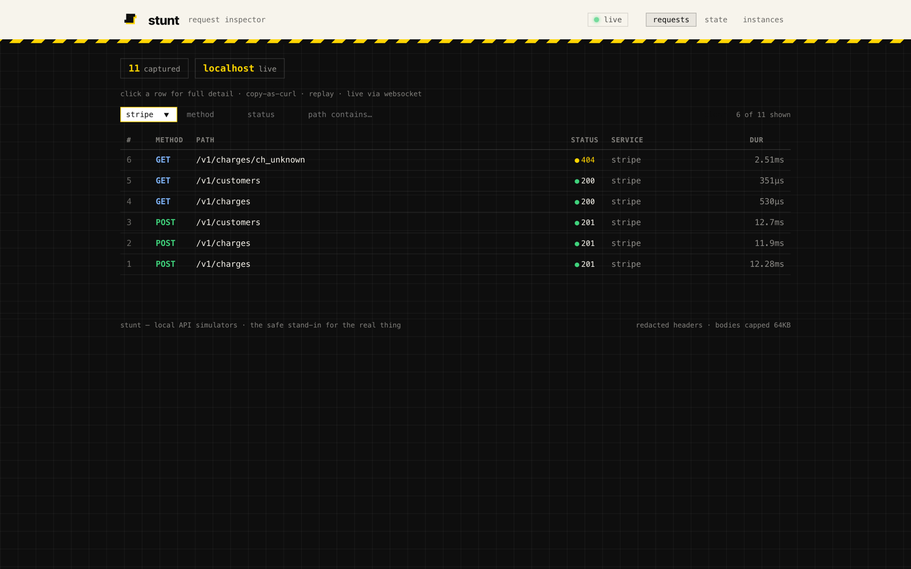
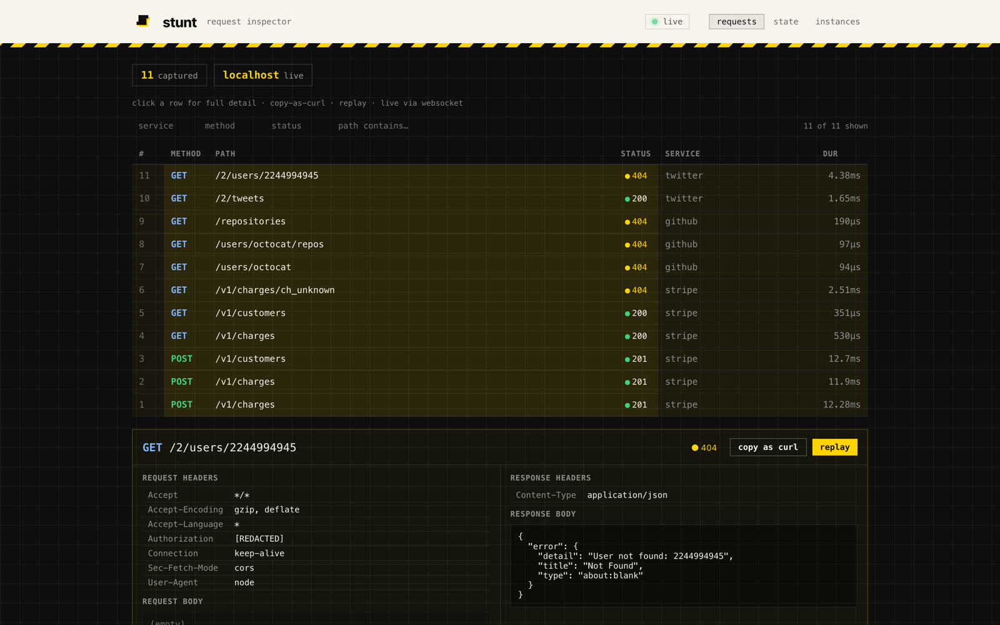
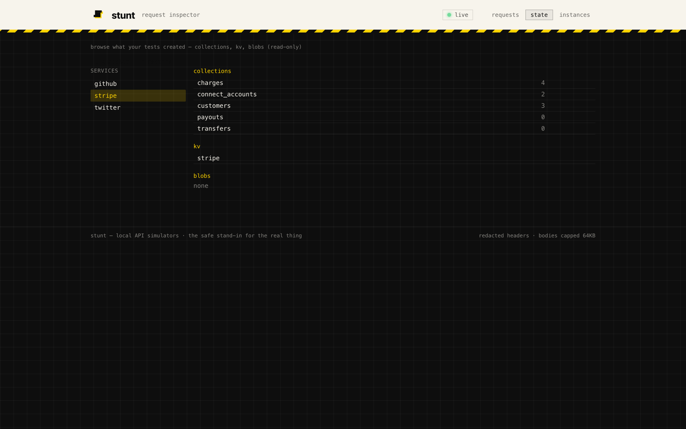
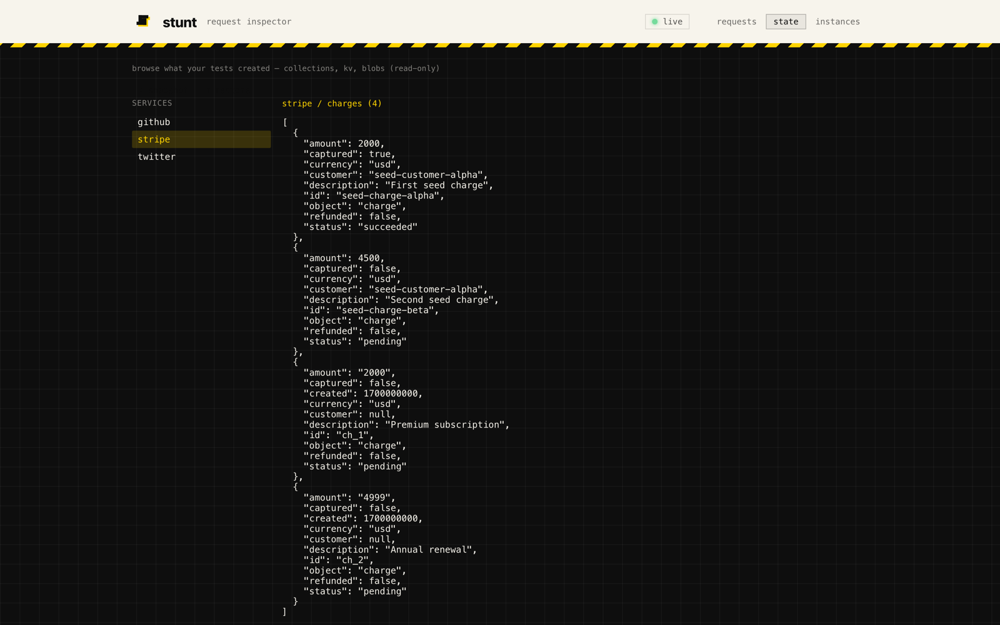
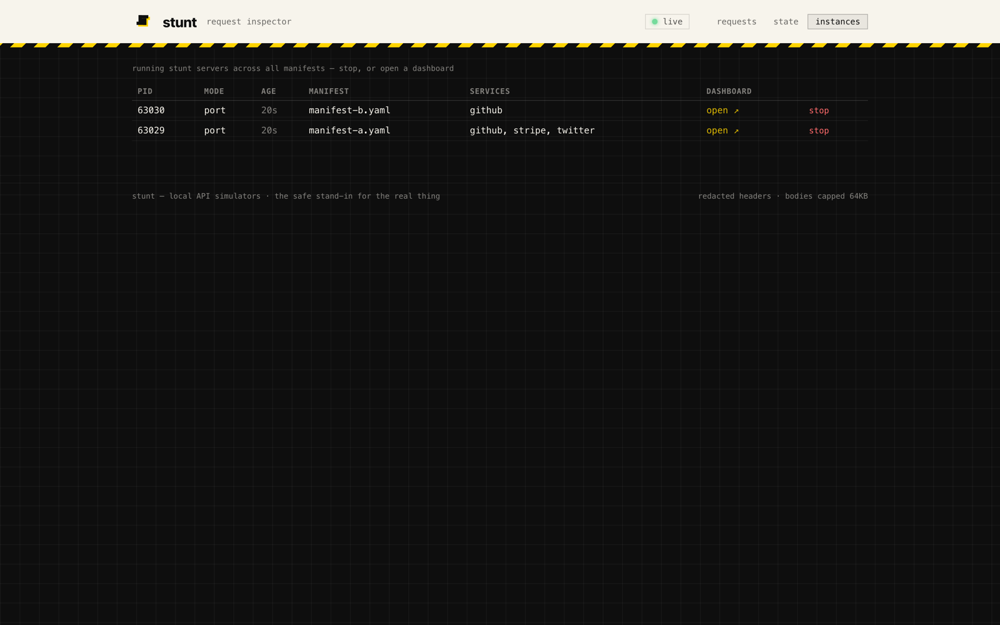

# The stunt dashboard — observability + control for your sims

Every running stunt server serves its **own localhost dashboard** — a real-time
request inspector, a state browser, snapshot/restore for deterministic runs, and a
multi-instance manager. There is no separate daemon and no IPC: the dashboard reads
the server's **in-process** state directly. Every feature has a matching CLI command
with `--json` output, so LLMs and CI drive the exact same surface a human does.

```
$ stunt up
  dashboard:  http://127.0.0.1:54321   (token: 9f3c1a…)
$ stunt ui          # open the dashboard in your browser
```

The dashboard URL + token are printed by `stunt up` and written to the manifest's
runtime file (`.stunt/runtime/up.json`). The CLI commands **auto-discover** the
running server from there, so you almost never need `--url`/`--token`.

> **Security baseline.** The admin server binds **loopback only** (`127.0.0.1`,
> never all-interfaces), requires a random **session token** on every request, and
> rejects non-localhost `Host` headers as a [DNS-rebinding](https://en.wikipedia.org/wiki/DNS_rebinding)
> defense. Sensitive request **headers** (`Authorization`, `Cookie`, `Set-Cookie`,
> `X-API-Key`, `Proxy-Authorization`) are **redacted** before they're stored. The
> state directory is `0600` and `.gitignore`d. See the [security notes](#security) for
> the reasoning behind bodies-on-by-default.

---

## Contents

1. [Request inspector](#1-request-inspector)
2. [State browser](#2-state-browser)
3. [Snapshot, restore & reset — deterministic runs](#3-snapshot-restore--reset--deterministic-runs)
4. [Instance manager](#4-instance-manager)
5. [The CLI at a glance](#5-the-cli-at-a-glance)
6. [Architecture](#architecture)
7. [Security](#security)
8. [Common workflows](#common-workflows)
9. [Troubleshooting](#troubleshooting)

---

## 1. Request inspector

The **requests** tab is a live feed of every request hitting your sims — REST,
gRPC (unary + streaming), and WebSocket — with method, path, status, transport, and
**sub-microsecond** timing.


### What's captured

Each row records: a monotonic **sequence number** (gap-free ordering), timestamp,
**service**, **transport** (`http`/`grpc`/`ws`), **method**, **path**, **status**,
**duration** (microseconds), and the request/response **headers** + **bodies**.

- **Bodies are captured by default.** This is a localhost dev tool whose killer
  feature is showing you what you sent; see [security](#security) for why bodies-on
  is the right default and how the leak surface is minimized.
- **Sensitive headers are redacted** (`[REDACTED]`) before the entry is written.
- Bodies are size-capped (64 KB) and the log is a **bounded ring** (last 1000 per
  server), so the store never grows unbounded.

### Live + gap-free

The feed updates in real time over a **WebSocket**. If your connection drops, the
client reconnects and sends its last-seen sequence number; the server **backfills
the gap** from the log, then switches back to live — so a flaky connection never
silently hides the request you most wanted to see.

### Search & filter

A filter bar narrows the feed instantly (client-side): by **service**, **method**,
**status**, or free-text on the **path**. The "N of M shown" count reflects the
filter.



### Row detail, copy-as-curl, replay

Click any row to open the detail panel: full request/response headers (redacted) and
bodies. **copy-as-curl** reproduces the exact request; **replay** re-issues it
in-process against the sim's *current* state.



> **Replay semantics.** Replay runs the recorded request against **current** state —
> it is not a reset. Idempotency / duplicate-key handling is the adapter's concern
> (e.g. creating the same charge twice may produce two rows). The dashboard surfaces
> this caveat. The replayed request is logged exactly once as a fresh entry.

### CLI

```bash
# recent captured requests (human table)
stunt requests

# machine-readable JSON — feed to an agent or pipe through jq
stunt requests --json

# cap how many rows come back
stunt requests --limit 50

# live stream — like tail -f (Ctrl-C to stop)
stunt requests --follow

# full detail of one request (by id)
stunt request <id>

# re-issue a captured request against current state
stunt replay <id>
stunt replay <id> --json
```

All request/query commands auto-discover the running server from the manifest's
runtime file. Override with `--url` / `--token` if you have more than one server for
the same manifest, or are hitting a remote (not recommended) dashboard.

---

## 2. State browser

stunt's defining property is **stateful** simulation — your POSTs create data the sim
remembers across requests. That makes the follow-up question — *"did my POST create
the right state?"* — the most common debugging task, and a wire-only inspector can't
answer it. The **state** tab can: it browses the three backing stores per service,
**read-only**.

- **Collections** — SQLite-backed document stores (e.g. a Stripe-style adapter's
  `charges`, `customers`). Shown with live counts.
- **KV** — namespaced key/value pairs (counters, config, cursor state).
- **Blobs** — filesystem-backed file uploads (e.g. a Drive/S3-style adapter's
  objects), with size + content type.



Drill into a collection to inspect the actual JSON documents your tests created:



The state browser reflects exactly what the sim will return on the next read, so you
can confirm a create/update/delete landed before asserting on it in your test.

### CLI

```bash
# list a service's collections (with live counts)
stunt state collections <service>

# list the documents in one collection
stunt state collection <service> <name>

# list kv namespaces, or the pairs in a specific namespace
stunt state kv <service>
stunt state kv <service> --ns <namespace>

# list uploaded blobs (optionally within a namespace)
stunt state blobs <service>
stunt state blobs <service> --ns <namespace>

# every command takes --json for machine-readable output
stunt state collections stripe --json
```

---

## 3. Snapshot, restore & reset — deterministic runs

Non-determinism is the enemy of reliable tests. stunt gives you three levers, from
lightest to strongest:

- **`stunt reset`** — wipe state to a clean slate (one service, or all).
- **`stunt snapshot save`** — capture the *current* state to a portable file.
- **`stunt snapshot load`** — restore the exact state from a snapshot, replacing
  whatever is there now.

The headline workflow is **snapshot → run → restore**: capture a known-good state,
run a flaky test against it (which may dirty it), then restore the pre-test state —
so the next run starts from the exact same place. Reruns become reproducible.

### What a snapshot contains

A snapshot is a **`.tar.gz`** of a *logical* dump — not a raw copy of the SQLite/blob
files. That choice is deliberate:

- It goes through the same accessor API as the browser/reset, so it's robust to
  on-disk layout changes.
- It's **portable and debuggable**: `tar tzf snapshot.tar.gz` lists
  `<service>/collections.json`, `<service>/kv.json`, and `<service>/blobs/…`.
- The **request log is not snapshotted** — it's observational, not simulator state.
  (`stunt reset --all` clears it; snapshots capture what the sim would *return*.)

Restore re-seeds collections, kv, and blobs by re-inserting through the real
primitives, so triggers/seeds behave exactly as on first run.

### CLI

```bash
# wipe one service's state
stunt reset <service>

# wipe every service's state AND the request log (full clean slate)
stunt reset --all

# save a snapshot (default filename: stunt-snapshot-<timestamp>.tar.gz)
stunt snapshot save
stunt snapshot save -o known-good.tar.gz

# restore from a snapshot (wipes current state first, then re-seeds)
stunt snapshot load known-good.tar.gz
```

Both are also exposed in the dashboard's **state** tab as ⤓ snapshot / ⤒ restore
controls.

> **Tip — pin your test setup.** Commit a `known-good.tar.gz` per test suite. In CI:
> `stunt up & ; sleep 2 ; stunt snapshot load ci-baseline.tar.gz ; ./run-tests`.

---

## 4. Instance manager

Running more than one stunt server (one per project, or several manifests)? The
**global registry** (`~/.stunt/instances.json`) tracks every running server across
all manifests, and `stunt ps` lists them. The **instances** tab in each dashboard
shows the same list, lets you jump to another instance's dashboard, and stop any of
them.



### Self-healing

Servers that crash leave a stale entry. On every read (`stunt ps`, or the instances
tab), dead entries are **pruned via a PID-liveness check** — so the list self-cleans
without manual tidying. (PID recycling is possible but rare for a localhost dev tool;
entries also store the manifest path, so a mismatch is detectable.)

### CLI

```bash
# list running servers across ALL manifests
# columns: PID, mode, age, manifest, dashboard, services
stunt ps
stunt ps --json

# stop one server (by PID), or the current manifest's (no arg)
stunt stop <pid>
stunt stop

# the original per-manifest stop (reads the manifest's runtime file)
stunt down
```

`stunt stop` (and `stunt down`, and the dashboard's stop button) shut a server down
**gracefully**: they POST to that server's authenticated `POST /api/shutdown`
endpoint, which cancels the same shutdown context Ctrl-C / SIGTERM does — so the
server drains in-flight requests and frees its port cleanly. This works on **every
platform**, including Windows (where cross-process signals don't exist); if the
dashboard is unreachable it falls back to a `SIGTERM`→`SIGKILL` escalation
(`TerminateProcess` on Windows). The instance is deregistered from the registry
either way.

---

## 5. The CLI at a glance

Every dashboard feature is reachable from the CLI, with `--json` for agents & CI.
Commands auto-discover the running server for the current manifest.

| Command | Purpose |
|---|---|
| `stunt ui` | open the dashboard in your browser |
| `stunt requests [--json] [--limit N] [--follow]` | captured requests (live stream with `--follow`) |
| `stunt request <id>` | full detail of one request |
| `stunt replay <id> [--json]` | re-issue a request against current state |
| `stunt state collections <svc>` · `collection <svc> <name>` | browse collections |
| `stunt state kv <svc> [--ns <ns>]` · `blobs <svc> [--ns <ns>]` | browse kv / blobs |
| `stunt reset [<svc>] [--all]` | wipe state (one service or all + request log) |
| `stunt snapshot save [-o file]` · `load <file>` | capture / restore state |
| `stunt ps [--json]` | list running servers across manifests |
| `stunt stop [<pid>]` · `stunt down` | stop a server |

Run `stunt llm` for the in-binary reference (handy as cold-start context for a coding
agent).

---

## Architecture

**Embedded, per-server.** Each `stunt up` serves its own dashboard on an
OS-assigned localhost high port, reading **in-process** state directly. No daemon, no
IPC, no shared control plane. The trade-off (vs. a central daemon) is that each
instance only sees its own request log in detail — but the global *registry* is the
thin shared layer that makes `stunt ps` and the instances tab work.

**Hot-path safety.** Request logging is **asynchronous**: the recorder captures
req/resp, redacts headers, caps bodies, and enqueues to a writer goroutine — it never
writes SQLite on the request path. The WebSocket fan-out is **non-blocking**
(drop-on-slow-consumer). A parked or slow dashboard tab can therefore never
backpressure or stall your simulated APIs. Logging latency is a *correctness* concern
for a faithful simulator, not a nicety.

**State layout.** Per manifest, under `<manifestDir>/.stunt/state/`:
`requests.db` (the log), `<service>.db` (collections), `<service>.kv.db` (kv),
`<service>.blobs/` (blob store). All `0600`. `stunt clean` wipes the lot.

**Auto-discovery.** `stunt up` writes `<manifestDir>/.stunt/runtime/up.json`
(`{pid, addresses, dashboard_url, dashboard_token, …}`). The CLI reads it to resolve
the dashboard URL + token, so zero flags are needed for the common case.

---

## Security

The dashboard is an **intentionally localhost-only** dev tool. The design choices:

- **Loopback-only bind.** The admin server listens on `127.0.0.1` explicitly and never
  falls back to all-interfaces. Exposing it remotely is a later, separately
  security-reviewed item.
- **Session token.** A random token is generated at start, printed to your terminal
  only, and required on every request (custom header `X-Stunt-Token`, or a cookie set
  via a `?token=` bootstrap that immediately redirects). It's never auto-shared.
- **Host-header validation.** A token alone doesn't stop
  [DNS rebinding](https://en.wikipedia.org/wiki/DNS_rebinding): a malicious site can
  rebind to `127.0.0.1` and fetch against your dashboard. So the server rejects any
  request whose `Host` isn't `localhost` / `127.0.0.1` / `[::1]`.
- **Header redaction.** Sensitive request headers are redacted to `[REDACTED]` before
  persistence — so a captured `Authorization: Bearer …` doesn't sit in your log.
- **Bodies on by default.** For a localhost tool, *you* chose to send these requests
  and the sim already holds this state; making bodies opt-in would gut the inspector's
  value. The realistic leak risk is **repo/CI/screenshare**, mitigated by `0600` perms,
  bounded rotation, header redaction, and a `.gitignore` entry for the state dir.
  If a body contains a real secret, that's a sign it shouldn't have been sent to a sim
  in the first place — point your code at the sim, don't paste prod credentials in.

---

## Common workflows

### "Did my POST create the right state?"
The #1 debugging loop. Send your request, then:
```bash
stunt state collection stripe charges --json   # see exactly what was stored
```
…or click the **state** tab → service → collection. Confirm the shape/fields before
asserting on it in your test.

### Deterministic test runs
```bash
stunt up &; sleep 2
# set up your baseline once (seed data, auth state, …)
stunt snapshot save -o baseline.tar.gz
# each test run starts from the exact same place:
stunt snapshot load baseline.tar.gz
./run-tests
```

### Debug a failing integration test
1. `stunt requests --follow` in a terminal — watch the traffic live as your test runs.
2. Spot the odd one (wrong status? missing body?), click it for full detail.
3. `stunt replay <id>` to re-issue it and watch the **state** tab change.

### Manage sims across projects
```bash
stunt ps                       # what's running, where, on what port
stunt stop <pid>               # reclaim a forgotten one
```

---

## Troubleshooting

- **"no running stunt server"** — the CLI couldn't find the runtime file. Run `stunt up`
  for that manifest, or pass `--url`/`--token` explicitly.
- **Dashboard shows "connecting" forever** — the WebSocket couldn't connect (rare on
  loopback). Check nothing else is squatting the port; restart `stunt up`.
- **`stunt ps` shows a server that's actually dead** — it prunes on read, so just run it
  again; or `stunt stop <pid>` to clear it.
- **Replay gives a different result than the original** — expected: replay runs against
  *current* state, not the state at capture time.
- **Snapshot restore reports a version mismatch** — the archive format changed between
  stunt versions; re-snapshot with the current binary.

---

*Every dashboard command is documented in `stunt llm`; the full CLI + manifest +
Starlark reference is in [`AGENTS.md`](../AGENTS.md).*
